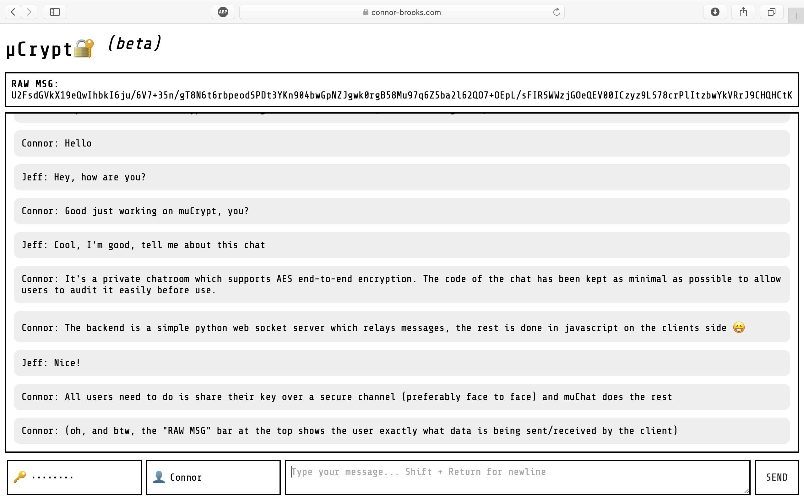

# muCrypt
*μCrypt Messenger: A secure & simple end-to-end encrypted chat*

## Requirements (Server)
* Python 3
* Python websockets
* Python ssl
* Python asyncio

## Requirements (Client)
* Any modern web browser

# How to use
## Setup and enter python virtual environment (optional)
* `python3 -m venv mucrypt`
* `cd mucrypt`
* `source ./bin/activate

## Install dependencies 
* `pip3 install websockets asyncio ssl`

## Grab the server script
* `wget https://raw.githubusercontent.com/connor-brooks/muCrypt/master/server/server.py`

## Edit the server script
Using a text editor to modify the following lines of `server.py` to reflect your servers certificate paths:
* `cert = "/path/to/ssl/cert.pem"`
* `privKey = "/path/to/privkey.pem`

## Get the client files:
Enter the directory you wish to serve the HTML client from, in this example, the path `/var/www/html/mucrypt` is used.
* `cd /var/www/muCrypt`
* `git clone https://github.com/connor-brooks/muCrypt`
* `mv muCrypt/server/* .`
* `rm -rfv muCrypt`

## Edit the client script:
Using a text editor modigy the following lines of `script.js`, changing example.com to your own domain:
* `var ws = new WebSocket("wss://your-domain.com:8765/");`

## Run the server
To run the server, simply run:
* Run `nohup /path/to/your_server_script/server.py &`
* if you are using the venv, remember to run `source /path/to/your/venv/bin/activate first.
* Setting up an init script would be an easy way to keep the server running automatically.
